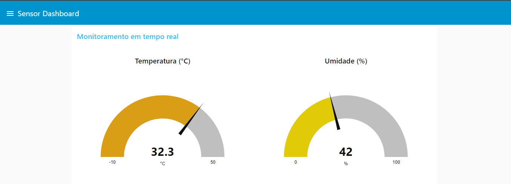

# IoT - Sistema de Controle de Temperatura e Umidade Residencial

Desenvolvido por [Leonardo Donato](https://github.com/leopdonato) - leonardo.donato@aluno.ifsp.edu.br / [Rodrigo Betussi](https://github.com/betussi) - rodrigo.betussi@aluno.ifsp.edu.br

## Projeto de Trabalho de Conclusão da Disciplina de Plataformas de Prototipação para IoT (E2PPT) - IFSP CTD

### Visão Geral

Este projeto visa monitorar, em tempo real, a temperatura e umidade de um ambiente através do sensor DHT11. As informações são armazenadas em banco de dados (DynamoDB), sendo possível ter a visualização completa, através de um gráfico, do histórico das coletas para futuras análises. O sistema é composto por três conjuntos principais:

1. **Publicação de Dados via MQTT**:  
   Através do ESP32 os dados do ambiente são coletados e, através do tópico iot/sensor/data, são publicados atráves do protocolo MQTT.

3. **Controle de Temperatura e Umidade (Back-End)**:  
   Via Node-Red as informações de temperatura e umidade são recebidas e armazenados no banco de dados DynamoDB.

4. **Visualização dos Dados**:  
   As coletas podem ser visualizadas através de duas abas, onde temos o tempo real e gráfico/tabela.

O código completo pode ser visualizado atráves do link abaixo:
   Código ESP32 - https://github.com/betussi/esp32-iot/blob/main/DTH11_Sensor_MQTT_Chaves.ino

### Componentes e Infraestrutura Utilizada
- Sensor DHT11
- ESP32
- Protocolo de comunicação MQTT
- Node-Red (Back-end e Front-End) hospedado na AWS
- Banco de Dados - AWS DynamoDB

### Node-Red - Flow
http://ec2-52-14-56-16.us-east-2.compute.amazonaws.com:1880/#flow/9836ac50350623ca

### Node-Red - UI
http://ec2-52-14-56-16.us-east-2.compute.amazonaws.com:1880/ui

## Monitoramento em tempo real

## Gráfico com os dados coletados e armazenados no banco de dados DynamoDB

## JSONs

[ESP32 - MQTT](https://github.com/betussi/esp32-iot/blob/main/node-red/ESP32%20-%20MQTT.json)

[Gráficos](https://github.com/betussi/esp32-iot/blob/main/node-red/Gr%C3%A1ficos.json)

### Simulação Wokwi

Os circuitos estão simulados na plataforma Wokwi e podem ser acessados através do link abaixo:
[https://wokwi.com/projects/411449430671253505](https://wokwi.com/projects/411449430671253505)

## Simulação da montagem do projeto

## Simulação do projeto em execução

## Resultado da coleta feita via Wokwi

